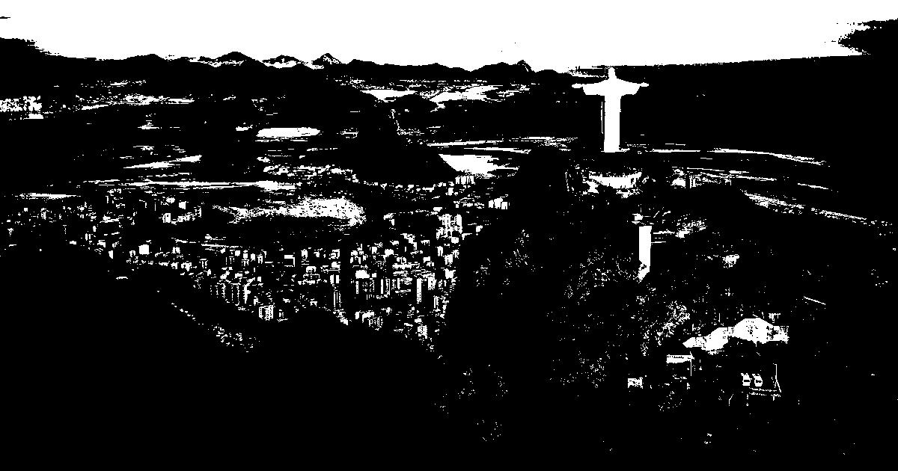

# PYNQ-overlay
PYNQ overlay to accelerate some Python functions.

This project aims at accelerating Python functions from the [OpenCV library](https://opencv.org/ "OpenCV") using [PYNQ](http://www.pynq.io/ "PYNQ"). We implemented the [threshold function](https://docs.opencv.org/master/d7/d1b/group__imgproc__misc.html#gae8a4a146d1ca78c626a53577199e9c57 "threshold") with binary mode, which sets the values of the input array to a predefined value if its intensity exceed a certain threshold, otherwise sets it to zero. The [erode function](https://docs.opencv.org/4.5.2/d4/d86/group__imgproc__filter.html#gaeb1e0c1033e3f6b891a25d0511362aeb "erode") is a work in progress.

### Table of contents
* [1) Context](#context)
* [2) Requirements](#requirements)
* [3) Content](#content)
  * [3.1) Create the custom IP block](#create)
  * [3.2) Integrate the custom IP block to the overlay](#integrate)
* [4) Running the App](#app)
* [5) Results](#results)
* [6) Using PYNQ peripherals](#peripherals)
* [7) Axes of improvement](#improvement)

---

## 1) Context
PYNQ (Python Productivity for Zynq) is an open-source project from Xilinx® that allows the use of Python language and libraries through [Jupyter Notebook](https://jupyter.org/ "Jupyter").
We use the compliant [PYNQ-Z2 board](https://www.tul.com.tw/productspynq-z2.html "PYNQ-Z2"). 
It contains a Programmable logic equivalent to Artix-7 [FPGA (Field-Programmable Gate Array)](https://www.xilinx.com/products/silicon-devices/fpga/what-is-an-fpga.html "FPGA") that we are going to configure.

As defined in the [PYNQ documentation](https://pynq.readthedocs.io/en/v2.6.1/pynq_overlays.html "PYNQ overlays"), "overlays, or hardware libraries, are programmable FPGA designs that extend the user application from the Processing System of the Zynq into the Programmable Logic. They can be used to accelerate a software application [...]. An FPGA overlay is a virtual reconfigurable architecture that overlays on top of the physical FPGA configurable fabric".

This [tutorial](https://www.youtube.com/watch?v=Dupyek4NUoI "How to make a custom PYNQ overlay") explains how to develop your own overlay with [Vivado](https://www.xilinx.com/support/university/vivado.html "Vivado") and PYNQ.

---

## 2) Requirements
List of requirements for this project :
- [PYNQ v2.6.1](https://pynq.readthedocs.io/en/v2.6.1/ "PYNQ Doc")
- [PYNQ-Z2 board](https://www.tul.com.tw/productspynq-z2.html "PYNQ-Z2")
- [Vivado Design Suite - HLx Editions - 2019.2](https://www.xilinx.com/support/download/index.html/content/xilinx/en/downloadNav/vivado-design-tools/archive.html "Vivado HLx")

Actions :
- Setup the PYNQ-Z2 board by following this [guide](https://pynq.readthedocs.io/en/v2.6.1/getting_started/pynq_z2_setup.html "Setup card"). The boot files are located [here](http://www.pynq.io/board.html "Flash card").
- Install on Vivado the [Vivado board files for PYNQ-Z2](https://pynq.readthedocs.io/en/v2.3/overlay_design_methodology/board_settings.html#vivado-board-files "Board files"). In case the link is broken, try [this one](https://www.tul.com.tw/productspynq-z2.html "PYNQ-Z2 TUL"). You may need to use [Win32 Disk Imager](https://win32diskimager.download/ "Win321Disk Imager"), [Putty](https://www.putty.org/ "Putty") and a micro SD to SD adapter.

---

## 3) Content
...................................................... .

expliquer process..................
3 IP blocks + run automation connection
The Zynq-7000 device is referenced by the code xc7z020clg400-1.

---

## 3.1) Create the custom IP block
This tutorial video shows how to create the custom IP block. Click on the thumbnail to play the video. You may have to download the video.

---

## 3.2) Integrate the custom IP block to the overlay
This tutorial video shows how to integrate the custom IP block to the PYNQ-Z2 overlay. Click on the thumbnail to play the video. You may have to download the video.

Here is the final block design :

It contains a hierarchy ('threshold') for our custom IP block :

---

## 4) Running the App
Once the PYNQ-Z2 card is setup, 

dire lien ip et log/pwd
overlayfiles + img in outfolder + notebook

---

## 5) Results
For now, only the threshold function of binary type is implemented. 

- Input image :

- Output image :

Let's compare the overlay performances to the original OpenCV function and the Python function remake, using the same input image and parameters. We study the duration across 5 runs.

| OpenCV  | Remake     | Overlay   |
|:---:    | :---:      | :---:     | 
| 5.5 ms  | 37146.5 ms | 2846.7 ms |
| 6.4 ms  | 37387.0 ms | 2901.8 ms |
| 5.5 ms  | 36541.3 ms | 2890.1 ms |
| 6.9 ms  | 37202.1 ms | 2881.7 ms |
| 6.8 ms  | 37069.5 ms | 2887.6 ms |

The average durations after this test are the following :
| OpenCV    | Remake         | Overlay       |
|:---:      | :---:          | :---:         | 
|**6.2 ms** | **37069.3 ms** | **2881.6 ms** |

We can deduce that in this test, the overlay function is almost 13 times faster than the remake function. However, it is still around 465 times slower than the original OpenCV implementation. This result was expected given that OpenCV is an optimized library. 

Furthermore, the results for the three functions are identical. To check that, we computed the mean value of the absolute difference between the output arrays, two by two.

---

## 6) Using PYNQ peripherals
So as to explore the PYNQ field of possibilities, we replaced the part of loading an image from a folder by an input stream coming from the HDMI port. To do so, we connected the HDMI port to a computer opened on a webpage, and followed the [HDMI-in tutorial](https://pynq.readthedocs.io/en/v2.6.1/pynq_libraries/video.html "PYNQ video module"). We also worked with GPIO using the [RGB LED](https://pynq.readthedocs.io/en/v2.4/pynq_package/pynq.lib/pynq.lib.rgbled.html "PYNQ RGB LED module"), whose driver source code can be found [here](https://pynq.readthedocs.io/en/v1.3/_modules/pynq/board/rgbled.html "RGBLED source code").

---

## 7) Axes of improvement
- Make changes in the kernel code of the kernel code of the threshold function to further reduce the execution time;
- Improve the design of the Python driver class;
- Implement the IP block of the erode function;
- Combine the custom IP blocks with the RGB LED and the HDMI in a same overlay. Either start from the whole [PYNQ-Z2 base overlay](https://github.com/Xilinx/PYNQ/tree/master/boards/Pynq-Z2/base "PYNQ-Z2 Base Overlay"), adding the custom IP, or start from zero. This [tutorial](https://discuss.pynq.io/t/tutorial-rebuilding-the-pynq-base-overlay-pynq-v2-6/1993 "Rebuilding the base overlay") may help;
- Configure the HDMI-out peripheral to display the results on an external screen;
- Apply the function continuously on a video stream.

---
photo pynq branchements et dire que branhcer port hdmi-in

The Xilinx® Zynq® All Programmable device is an SOC based on a dual-core ARM® Cortex®-A9 processor (referred to as the Processing System or PS), integrated with FPGA fabric (referred to as Programmable Logic or PL). The PS subsystem includes a number of dedicated peripherals (memory controllers, USB, Uart, IIC, SPI etc) and can be extended with additional hardware IP in a PL Overlay.

expliquer threshold preprocess et postprocess

partie process avec les vidéos et explications framework = expliquer process + expliquer etaps dev
partie axes amelios : continuer optimiser code + traiter erode

open notebook in yourpynq and put overlays in folder ...

blabla processing system Xilinxmachin

expliquer rôle threshold - Thresh figé params
goal : maipulate matrices and use dma for large arrays et dev custom ip block intergrate in own overlay and use it with a Driver on notebook

link videos

Requirements finir :
Xilinx Zynq®-7000 All Programmable SoC (AP SoC) family
slide 78 pwpt

recap des étapes de dev

DMA allows to deal with large arrays = good for images + def dma

compare speed with the 3
SAVE PROJECT WHOLE and put on github

parler des 3 fichiers d'intérêt décrivant overlay

expliquer contenu dossiers

dire goal réel

https://www.youtube.com/watch?v=LomArt-hi4M
https://pynq.readthedocs.io/en/v2.6.1/overlay_design_methodology/overlay_tutorial.html

+ parler des fichiers au final juste notebook et placer overlays dans dossier

Évite d’installer des librairies sur PYNQ sans pour autant consommer bcp

photo in/out + hdmi same + temps + results same + ccl
+ partie results

+ ip block that ocntains the function to accelerate + blabla adaptations

+ partie utilsiation notebook

def hls + def rtl

Login/password : xilinx/xilinx
10.104.210.36:9090

documentation du custom IP rôle des paramètres et de la fonction avec output array

se passer d'import

https://pynq.readthedocs.io/en/v2.6.1/pynq_overlays/pynqz2/pynqz2_base_overlay.html#user-io
https://pynq.readthedocs.io/en/v2.6.1/_modules/pynq/lib/rgbled.html
https://pynq.readthedocs.io/en/v2.6.1/pynq_libraries/video.html

https://discuss.pynq.io/t/tutorial-rebuilding-the-pynq-base-overlay-pynq-v2-3/61

axe amelio avoir hdmi dedans (manque de temps) : todo alléger https://pynq.readthedocs.io/en/v2.6.1/pynq_overlays/partial_reconfiguration.html

place overlays files in folder overlay

photo pynq https://www.mouser.be/new/dfrobot/dfrobot-pynqz2-dev-board/

First, we used the OpenCV funcitons threshold and erode. Then, we reproduced it with raw Python code and obtained the same output data. The next step was to translate it to C++ language, and the final one was to adapt it to HLS (pragmas for bus declaration, loop optimization, no cmath nor malloc directly).

+ specific params of thresh (binary) = erode (kernel size and values ?)

https://pynq.readthedocs.io/en/v2.6.1/overlay_design_methodology/overlay_tutorial.html

access via network Ethernet : 10.104.210.46:9090/

- PYNQ amelio avoid reload switch between overlay and base overlay when using hdmi source and processing it, original C++ with test, kernel code HLS project, the 3 files for overlay, Vivado project, Pupyter Notebook + pragma https://www.xilinx.com/html_docs/xilinx2020_1/hls-guidance/qoa1585574520885.html pipeline + screen vivado overlay = recap avant hls

https://github.com/marcomontalbano/video-to-markdown

voir fiches pwpt de erode et trheshold pour expliquer settings !

// Change shape array 2D grayscale ? https://appdividend.com/2020/06/22/how-to-convert-pil-image-to-grayscale-in-python/
// GitHub : readme context, theme (vivado, pynq, overlay, dma, opencv functions hw accelerate, pragma pipelne, ap_axis), screens (project, results), Video tuto, original C++ with test, kernel code HLS project, the 3 files for overlay, Vivado project, Pupyter Notebook
// HDMI (to threshold with grayscale) + RGB with the kernel in same overlay PYNQ Z2
// Compare speed with GColab library code (and Python raw translation)
// Add PIPELINE pragma for loop https://www.xilinx.com/html_docs/xilinx2020_1/hls-guidance/qoa1585574520885.html
// Try just val
reliable result
// TODO compléter avec code C++ de base étoffer version HLS

